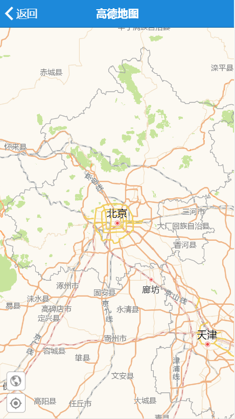
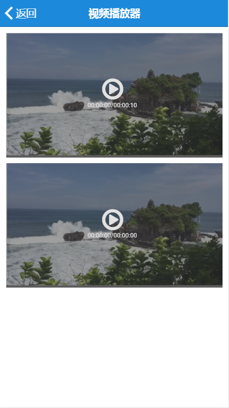
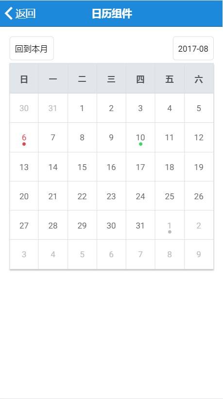

# essence-ionic

This is ionic custom components.

## Introduce

1. essence-ion-amap（高德地图）

	

2. essence-ion-videoplayer（视频播放器）

	

3. essence-ion-calendar（日历）

	

## Usage

1. Install

	```shell
	npm install --save essence-ionic@latest
	```

2. Add the EssenceIonicModule

	```typescript
	import {EssenceIonicModule} from "essence-ionic";
	@NgModule({
	    imports: [
	        // 使用essence-ion-amap需要调用initAMapAPI初始化，其中apiKey是高德地图API key，请到官网申请。
	        EssenceIonicModule.initAMapAPI({apiKey: '92876784ab731cccce8ebd5a8030290f'})
	    ]
	})
	```

## Use components

### essence-ion-amap

1. Use in Template

	```html
	<essence-ion-amap (ready)="amapReady($event)" (destroy)="amapDestroy($event)"></essence-ion-amap>
	```

2. Use in component

	```typescript

    constructor() {}

    amapReady ($event: EssenceIonAMapComponent) {
        console.log($event);
    }

    amapDestroy ($event) {
        console.log($event);
    }
	```

### essence-ion-videoplayer

1. Use in Template

	```html
    <div #videoDiv>
        <essence-ion-videoplayer (ready)="videoViewerReady($event)" [source]="url" [width]="videoDiv.offsetWidth"></essence-ion-videoplayer>
    </div>
	```

2. Use in component

	```typescript
	url: string = 'http://www.laixiangran.cn/CDN/custom/video/test.mp4';

    constructor() {}

    videoViewerReady($event: any) {
        console.log($event);
    }
	```
	
### essence-ion-calendar

1. Use in Template

	```html
	<essence-ion-calendar [schedules]="schedules"
						  (ready)="onReady()"
						  (ViewSchedule)="onViewSchedule($event)"
						  (dateChange)="onDateChange($event)">
	</essence-ion-calendar>
	```

2. Use in component

	```typescript
	schedules: any;

	constructor() {
		this.schedules = [
			{
				date: new Date(),
				data: {
					title: '参加会议',
					address: '公司会议室',
					content: '讨论考核制度',
					info: '参会人员包括：张三、李四'
				}
			}
		]
	}

	onReady() {
		console.log('日历组件加载完成！');
	}

	onDateChange($event: Date) {
		console.log($event);
	}

	onViewSchedule($event: any) {
		console.log($event);
	}
	```

## API

### essence-ion-amap

#### Inputs

- `options`（`?Object`） - 地图初始化参数对象，[参数详情](http://lbs.amap.com/api/javascript-api/reference/map)

- `showCurrentLocation`（`?boolean=false`） - 是否显示定位按钮，true为显示

- `showLocationMarker`（`?boolean=true`） - 是否显示定位之后的图标，true为显示

- `showTraffic`（`?boolean=false`） - 是否加载实时交通图层，true为加载

#### Outputs (event)

- `ready($event)` - 地图初始化完成事件，参数$event为当前EssenceIonAMapComponent实例对象

- `destroy($event)` - 地图销毁事件

- `location($event)` - 地图定位成功事件，参数$event为{code，info, result}

### Properties

- `eAMap`（`any`） - 高德地图对象AMap

### essence-ion-videoplayer

#### Inputs

- `width`（`?number=0`） - 视频播放器的宽度

- `height`（`?number=0`） - 视频播放器的高度

- `poster` (`?string`) - 视频海报路径

- `source`（`string`） - 视频路径

#### Outputs (event)

- `ready($event)` - 视频播放器初始化完成事件，参数$event为当前EssenceIonVideoplayerComponent实例对象

- `videoPlay($event)` - 视频播放开发事件

- `videoPause($event)` - 视频播放暂停事件

- `videoEnded($event)` - 视频播放结束事件

- `videoPan($event)` - 视频滑动快进/退事件

- `videoError($event)` - 视频播放错误事件

### essence-ion-calendar

#### Inputs

- `schedules`（`?Array<{date: Date, data: any}>`） - 要显示在日历中对应日期的数据

#### Outputs (event)

- `ready($event)` - 日历初始化完成事件，参数$event为当前EssenceIonCalendarComponent实例对象

- `dateChange($event)` - 日期改变事件，参数$event为改变之后的日期

- `viewData($event)` - 查看对应日期的数据

# License

[](/LICENSE)


